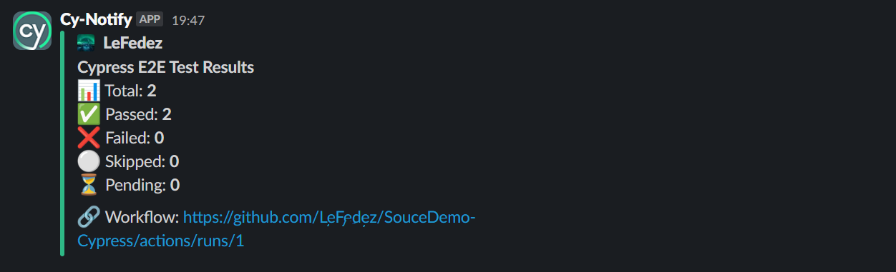

# 🚀 Cypress E2E Slack Reporter

[](https://github.com/your-org/cypress-e2e-slack-reporter)
[](LICENSE)

A GitHub Action to run [Cypress](https://www.cypress.io/) end-to-end tests, generate Mochawesome reports, and send a summary of results to Slack. Designed for seamless CI integration and clear team notifications.

> **Inspired by:** [rtCamp/action-slack-notify](https://github.com/rtCamp/action-slack-notify) 🙌

---

## 📦 Quick Start

Add this workflow to `.github/workflows/cypress-e2e.yml`:

```yaml
on: [push, pull_request]

jobs:
  cypress-e2e:
    runs-on: ubuntu-latest
    steps:
      - name: Cypress to Slack
        uses: LeFedez/cypress-e2e-slack-reporter@v1.1.1
        with:
          node-version: 18
          cypress-command: npx cypress run --reporter mochawesome --reporter-options reportDir=cypress/results,overwrite=false,html=true,json=true
          slack-username: Cy-Notify
          slack-icon: https://cdn.sanity.io/images/o0o2tn5x/production/13b9c8412093e2f0cdb5495e1f59144967fa1664-512x512.jpg
          slack-title: "*Cypress E2E Test Results*"
          continue-on-cypress-error: true
          slack-webhook: ${{ secrets.SLACK_WEBHOOK }}
```

---

## ✅ Requirements

- Node.js 18+
- Cypress & Mochawesome as dev dependencies
- Slack Webhook URL stored as a GitHub Secret (`SLACK_WEBHOOK`)

---

## ⚙️ Configuration

Main input options (see `action.yml` for full list):

| Input                    | Required | Description                                      |
|--------------------------|----------|--------------------------------------------------|
| `slack-webhook`          | ✅       | Slack Incoming Webhook URL (GitHub Secret)        |
| `node-version`           | ❌       | Node.js version (default: 18)                     |
| `cypress-command`        | ❌       | Custom Cypress run command                        |
| `slack-username`         | ❌       | Display name for the Slack bot                    |
| `slack-icon`             | ❌       | Icon URL for the Slack bot                        |
| `slack-title`            | ❌       | Title for the Slack message                       |
| `continue-on-cypress-error` | ❌    | Avoid failing the workflow if tests fail (default: true) |

---

## 🔔 Slack Notification

After tests are executed, a summary is posted to Slack via [rtCamp/action-slack-notify](https://github.com/rtCamp/action-slack-notify).

**Includes:**
- Total, passed, failed, skipped, and pending tests
- Link to the workflow run
- Customizable bot name, icon, and message title

**To enable:**
1. Create a Slack Incoming Webhook
2. Add it to your GitHub repo as a secret named `SLACK_WEBHOOK`
3. (Optional) Customize the bot appearance using inputs

---

## 📸 Example Notification

Here’s an example of the Slack message you’ll receive after your Cypress tests run:



---

## 🛠️ Troubleshooting

- If `package-lock.json` is missing, the action defaults to `npm install` instead of `npm ci`.
- Double-check that the `SLACK_WEBHOOK` secret is correctly defined.
- File uploads to Slack are disabled by default for security reasons.
- Set `continue-on-cypress-error: true` to prevent workflow failure on test errors.

---

## 📁 Project Structure

```
.
├── .github/workflows/cypress-e2e.yml  # Example GitHub Action
├── action.yml                         # Action definition
├── cypress/                           # Cypress test files
├── cypress.config.js                  # Cypress config
└── package.json                       # Dev dependencies & scripts
```

---

## 📝 License

This project is licensed under the MIT License.